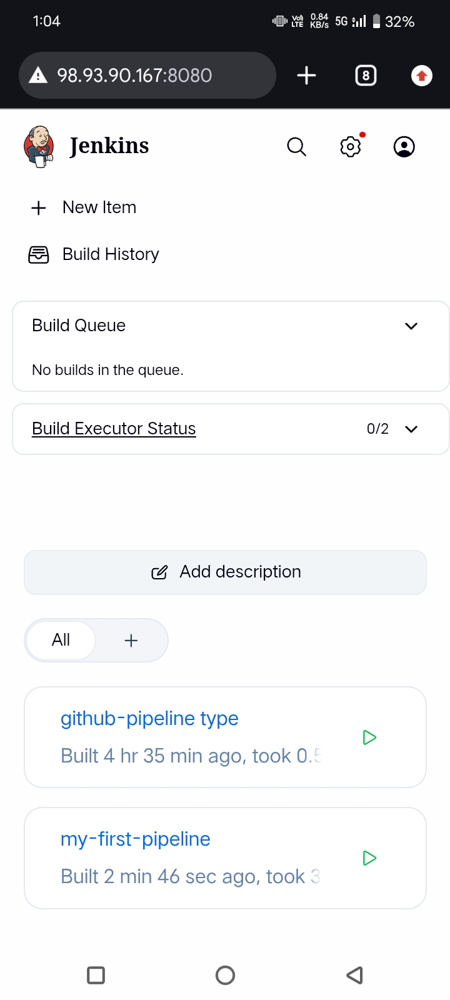
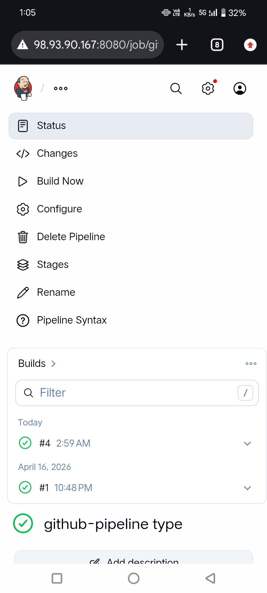
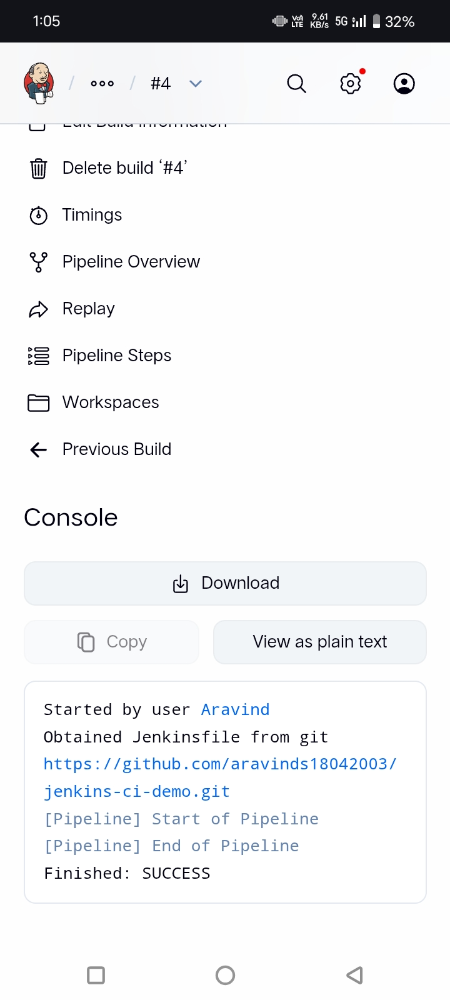
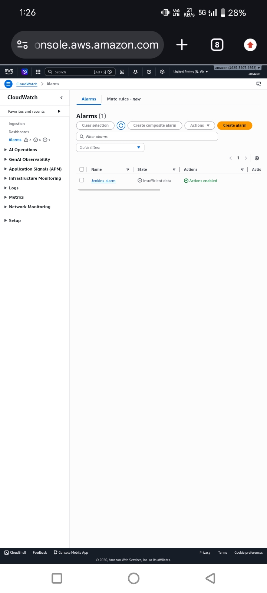
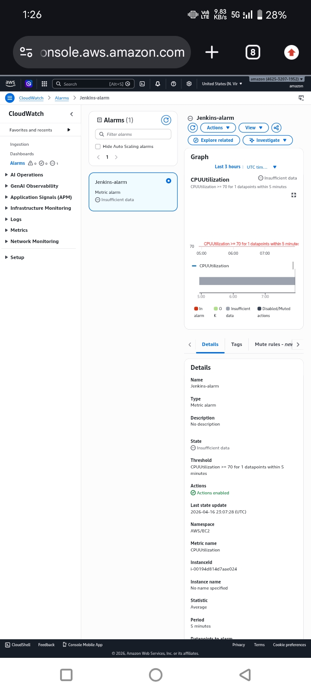
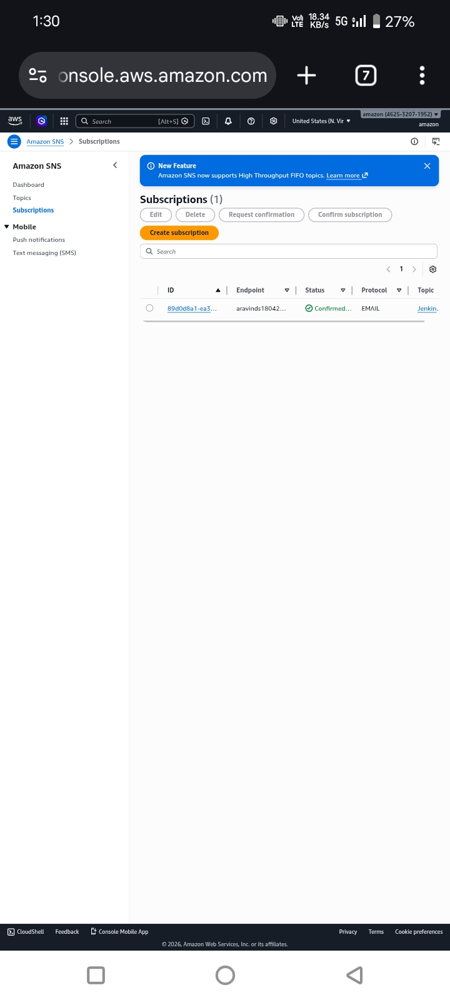
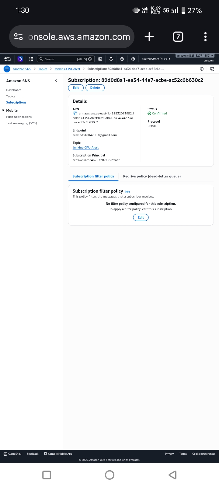

# Jenkins CI/CD Pipeline with CloudWatch Monitoring

## Architecture
GitHub Push → Poll SCM (Jenkins) → Build Pipeline → EC2
                                                      ↓
                                   CloudWatch → SNS Email Alert

## Tech Stack
| Service | Purpose |
|---|---|
| AWS EC2 | Jenkins server hosting |
| Jenkins | CI/CD automation |
| Git & GitHub | Source code management |
| Poll SCM | Auto-trigger builds on commit |
| AWS CloudWatch | CPU monitoring & alarms |
| AWS SNS | Email alert notifications |
| IAM Roles & Security Groups | Least-privilege access control |

## Features
- ~80% reduction in manual deployment effort via automated Jenkins pipelines
- Auto-triggered builds — Poll SCM detects GitHub commits and initiates builds within 1 minute
- CloudWatch CPU alarm — triggers SNS email alert when CPU exceeds 70% threshold
- Mean alert response time under 2 minutes via SNS email notifications
- Zero open inbound ports — EC2 locked down using IAM roles and Security Groups

## CI/CD Pipeline Flow
1. Developer pushes code → GitHub
2. Jenkins Poll SCM detects commit (within 1 min)
3. Build triggered automatically
4. Pipeline executes → Deploy ✅
5. CloudWatch monitors EC2 CPU
6. CPU > 70% → SNS Email Alert 📧

## Security
- IAM roles assigned to EC2 — no hardcoded credentials
- Security Groups configured with zero open inbound ports
- Least-privilege principle enforced throughout

## Screenshots

### Jenkins Setup

### CloudWatch Alarm

### SNS

